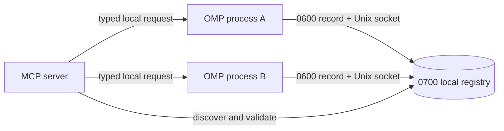

# OMP Instances

[Русская версия](README.ru.md)

Local MCP control plane for running [Oh My Pi](https://omp.sh/) processes.

Use it when several OMP sessions are running and one session needs to discover, inspect, message, interrupt, rename, or stop another. Communication stays on the local machine through user-only Unix sockets.

No browser UI. No TCP server.

## Install

```sh
curl -fsSL https://raw.githubusercontent.com/DKeken/omp-instances-control-plane/main/install.sh | sh
```

Restart running OMP processes after installation.

Installer is idempotent. Re-running same command updates installation and preserves unrelated MCP servers.

### What installer changes

- Installs repository into `~/.local/share/omp-instances-control-plane`.
- Installs locked Bun dependencies for MCP server.
- Backs up existing `omp-control.ts`, `omp-control.js`, and `mcp.json` under `~/.omp/agent/backups`.
- Installs exactly one runtime extension symlink: `~/.omp/agent/extensions/omp-control.ts`.
- Merges only `mcpServers["omp-instances"]` into `~/.omp/agent/mcp.json`.

Review before running a remote script:

```sh
curl -fsSL https://raw.githubusercontent.com/DKeken/omp-instances-control-plane/main/install.sh -o install.sh
cat install.sh
sh install.sh
```

## Available tools

| Tool | Purpose |
| --- | --- |
| `list` | List live OMP processes, aliases, PIDs, sessions, models, working directories, and idle/busy state. |
| `inspect` | Read current metadata for one process. |
| `send` | Send a message to one OMP process. |
| `ask` | Send a correlated request and wait for explicit `reply`. |
| `reply` | Complete a pending correlated request. |
| `broadcast` | Send one message to every reachable OMP process. |
| `rename` | Assign a readable alias to one process. |
| `doctor` | Diagnose permissions, stale sockets, duplicate aliases, and stale reply files. |
| `interrupt` | Abort current model/tool operation without exiting OMP. |
| `shutdown` | Gracefully stop one OMP process. |

Targets accept exact alias, PID, instance ID, session ID, or unambiguous instance/session ID prefix.

## How it works



Each OMP process loads `omp-control.ts`. Runtime extension:

1. creates random instance ID;
2. writes process metadata to local registry;
3. listens on private Unix socket;
4. refreshes state every five seconds;
5. removes record and socket during graceful shutdown.

MCP server treats registry files as discovery metadata, not authority. Before action it checks process liveness and contacts target socket.

## Configuration

| Variable | Default | Purpose |
| --- | --- | --- |
| `OMP_INSTANCES_HOME` | `$XDG_DATA_HOME/omp-instances-control-plane` or `~/.local/share/omp-instances-control-plane` | Installed repository location. |
| `OMP_HOME` | `~/.omp/agent` | OMP agent configuration directory. |
| `OMP_MCP_CONFIG` | `$OMP_HOME/mcp.json` | MCP configuration file. |
| `OMP_INSTANCES_REF` | `main` | Repository branch installed by script. |
| `OMP_CONTROL_DIR` | `/tmp/omp-control-<uid>` | Shared runtime registry and socket directory. Must be same for every process. |
| `OMP_INSTANCE_NAME` | `<cwd-name>-<pid>` | Initial alias for one OMP process. |

Portable custom installation example:
```sh
curl -fsSL https://raw.githubusercontent.com/DKeken/omp-instances-control-plane/main/install.sh | \
  OMP_INSTANCES_HOME="$HOME/tools/omp-instances" sh
```

`OMP_INSTANCES_HOME` is fail-closed because installer archives, swaps, and may remove this directory during rollback. It must be a dedicated path. Installer rejects filesystem root, `HOME`, `OMP_HOME`, their ancestors, paths inside `OMP_HOME`, symlink targets, and existing directories whose `package.json#name` is not `omp-instances-control-plane`. `OMP_MCP_CONFIG` cannot be inside installation root.

## Updating

Run install command again. Installer prepares source, locked dependencies, and merged MCP configuration before changing active files. It then archives previous installation and activates repository, extension symlink, and MCP config as a rollback-backed transaction. Any activation error restores previous state.

Restart OMP processes so they load new runtime extension and MCP configuration.

## Rollback and uninstall

Backups are stored in `~/.omp/agent/backups` with one timestamp per installation.

To roll back an upgrade, stop OMP processes and restore matching repository and MCP backups:

```sh
rm -rf ~/.local/share/omp-instances-control-plane
tar -xzf ~/.omp/agent/backups/omp-instances-control-plane.<timestamp>.tar.gz \
  -C ~/.local/share
cp ~/.omp/agent/backups/mcp.json.<timestamp>.bak ~/.omp/agent/mcp.json
```

Installed extension symlink points to stable installation path, so restored repository supplies previous runtime automatically. Restart OMP processes after rollback.

If `OMP_INSTANCES_HOME`, `OMP_HOME`, or `OMP_MCP_CONFIG` was customized, use those paths instead.

For a first-install uninstall, stop OMP processes, remove `~/.omp/agent/extensions/omp-control.ts`, delete only `mcpServers["omp-instances"]` from MCP config, then remove installation directory.

## Security

- Registry directories: `0700`.
- Records and sockets: `0600`.
- Backup directory and extension backup directories: `0700`.
- MCP config backups, installation archives, and copied extension backups: `0600`.
- Transport: local Unix sockets only.
- Request and response frames are size-limited.
- No generic shell execution, file API, HTTP endpoint, clipboard API, or raw PTY injection.
- Same-user processes remain inside trust boundary. This project does not isolate mutually hostile processes running under same OS account.

See [SECURITY.md](SECURITY.md) for vulnerability reporting.

## Troubleshooting

### No instances appear

Restart OMP processes after installation. Confirm `~/.omp/agent/extensions/omp-control.ts` points into installed repository and every process uses same `OMP_CONTROL_DIR`.

### Target is ambiguous

Use full `instanceId` returned by `list`.

### Permission or stale socket errors

Run `doctor` with `fix: true`. It repairs registry permissions and stale files; it does not terminate live processes.

### MCP server does not load

Check `~/.omp/agent/mcp.json` entry and ensure configured Bun path still exists. Installer stores absolute Bun executable and install paths.

### Socket path is too long

Use shorter registry path for every process:

```sh
export OMP_CONTROL_DIR=/tmp/oc
```

## Development

```sh
bun install
bun run check
```

Repository layout:

- `packages/mcp-server`: MCP server and shared local protocol.
- `packages/omp-extension`: OMP runtime extension source.
- `install.sh`: idempotent installer and upgrade path.
- `skills/omp-orchestration`: optional agent/operator reference.

## License

Repository is public but not open source. No license grant has been provided. All rights reserved.
