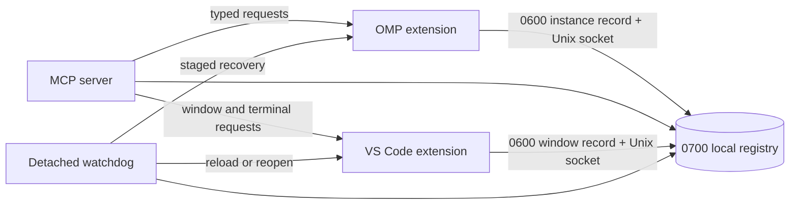

# OMP Instances Control Plane

Local orchestration for multiple [Oh My Pi](https://omp.sh/) processes and VS Code-compatible windows.

Repository contains three cooperating parts:

- **OMP extension** registers each live OMP process, status, model, session, and owning terminal.
- **MCP server** exposes instance and window operations as `omp_instances_*` tools.
- **VS Code / VSCodium extension** owns terminal tabs, shows fleet and recovery views, and runs local memory watchdog.

All control traffic uses user-only Unix sockets. No TCP listener, browser endpoint, CORS bridge, arbitrary editor command endpoint, or PTY text injection exists.

## Capabilities

### OMP instances

| MCP tool | Purpose |
| --- | --- |
| `list` | List live instances, status, model, session, cwd, and ownership. |
| `inspect` | Resolve target by alias, PID, UUID, session, or terminal identity. |
| `send` / `broadcast` | Deliver user messages to idle or busy OMP processes. |
| `ask` / `reply` | Correlated request/reply between OMP processes. |
| `rename` | Assign stable human-readable alias. |
| `interrupt` / `shutdown` | Abort turn or stop process gracefully. |
| `restart` | Resume persisted session in its terminal identity. |

### Editor windows

| MCP tool | Purpose |
| --- | --- |
| `list_windows` | List windows, workspaces, editor tabs, terminal tabs, and attached OMP instances. |
| `open_window` | Open workspace and wait for extension registration. |
| `create_omp` / `launch_team` | Start one OMP tab or team of independent tabs. |
| `resume_omp` | Resume persisted OMP JSONL session. |
| `focus` | Reveal owning terminal tab. |
| `reload_window` | Save files and reload registered editor window. |
| `show_dashboard` | Reveal Fleet and Health & Recovery views. |
| `doctor` | Report or repair stale artifacts and unsafe permissions. |
| `watchdog_status` | Read supervisor heartbeat and aggregate process-tree memory. |

## Requirements

- macOS or Linux. Control transport uses Unix domain sockets.
- [Bun](https://bun.sh/) 1.3 or newer.
- [Oh My Pi](https://omp.sh/) with extension and MCP support.
- VS Code or VSCodium 1.126+ for window/terminal orchestration. Instance-only MCP operation does not require editor extension.

## Install

Run one command:

```sh
curl -fsSL https://raw.githubusercontent.com/DKeken/omp-instances-control-plane/main/install.sh | sh
```

Installer:

- downloads current `main` into `~/.local/share/omp-instances-control-plane`;
- installs locked Bun dependencies;
- builds self-contained OMP extension and editor VSIX;
- backs up existing OMP extension and `mcp.json` under `~/.omp/agent/backups`;
- merges only `mcpServers["omp-instances"]`, preserving every other MCP server;
- installs editor extension through `codium` or `code` when either CLI is available.

Restart OMP and reload editor windows after completion.

Optional environment overrides:

| Variable | Purpose |
| --- | --- |
| `OMP_INSTANCES_HOME` | Installation directory. |
| `OMP_HOME` | OMP agent directory; default `~/.omp/agent`. |
| `OMP_MCP_CONFIG` | MCP JSON path; default `$OMP_HOME/mcp.json`. |
| `OMP_INSTANCES_REF` | Git branch to install; default `main`. |

Manual installation remains possible by following commands in `install.sh`.

## Configuration

### Shared control directory

Default: `/tmp/omp-control-<uid>`.

Set `OMP_CONTROL_DIR` for every OMP process, MCP server, and editor extension host when custom location is required. Socket paths must remain short; Unix socket path length is platform-limited.

### Editor settings

Extension contributes `ompOrchestrator.*` settings for executable path, default working directory, watchdog enablement, recovery policy, memory limit, breach samples, and polling interval. Memory limit is constrained to 5-10 GiB.

## Architecture



Registry records are discovery metadata, not authority. Each operation contacts target socket and revalidates live process identity before action.

## Security model

- Registry directories use mode `0700`; records and sockets use `0600`.
- No network listener. Access remains local to same OS user.
- Message and frame sizes are bounded.
- Stale PIDs are never trusted alone. Socket response and process liveness are checked.
- `doctor` with `fix: true` only repairs permissions and removes stale artifacts. It does not kill live processes.
- Editor extension exposes fixed typed actions only. It has no general file, shell, editor-command, clipboard, or HTTP control API.

Threat boundary: another process running as same OS user can access user-owned sockets and files. Project does not provide hostile same-user isolation.

## Recovery behavior

Default watchdog policy: 8 GiB aggregate descendant RSS, three consecutive breaches, 15-second sampling.

1. OMP breach: interrupt, graceful shutdown, hard kill only if hung, resume persisted session.
2. Editor breach: save and reload window first.
3. Repeated editor breach: reopen app/workspaces and resume persisted OMP sessions.

No `sessionFile` means no safe resume. Recovery reports failure rather than inventing state.

## Development

```sh
bun install
bun run build:omp-extension
bun run check
bun run package
```

Source packages:

- `packages/mcp-server`: Bun TypeScript MCP server and shared protocol.
- `packages/omp-extension`: modular OMP runtime extension source.
- `dist/omp-control.js`: generated self-contained OMP extension.
- `packages/vscode-extension`: CommonJS editor extension and watchdog.
- `skills/omp-orchestration`: optional operator reference; copy it into your OMP skills directory when wanted.

## Troubleshooting

- **No instances:** confirm OMP extension loaded and all processes share `OMP_CONTROL_DIR`.
- **Instances but no windows:** editor extension is absent, disabled, or window has not reloaded.
- **Ambiguous target:** use full instance/window UUID returned by list tools.
- **Permission mismatch:** run MCP `doctor` with `fix: true`.
- **Cannot open editor:** set `OMP_VSCODE_CLI` or editor setting to valid `code` / `codium` binary.
- **Socket path too long:** use shorter `OMP_CONTROL_DIR`, such as `/tmp/oc`.

## License

No open-source license has been granted yet. All rights reserved.
