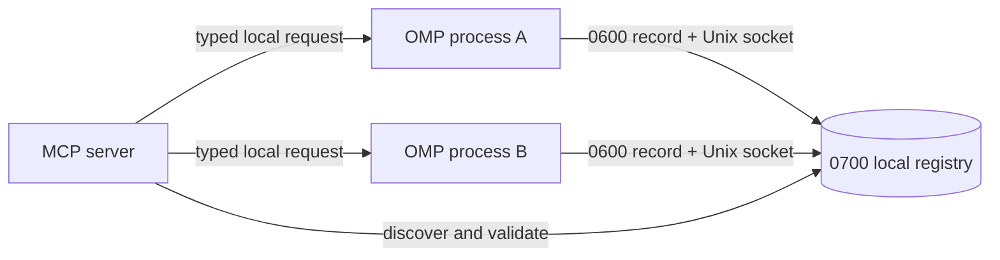

# OMP Instances

[English version](README.md)

Локальный MCP control plane для запущенных процессов [Oh My Pi](https://omp.sh/).

Он нужен, когда одновременно работают несколько OMP-сессий и одна сессия должна найти, проверить, переименовать, прервать, остановить другую или отправить ей сообщение. Всё общение остаётся на компьютере и проходит через закрытые Unix sockets текущего пользователя.

Без браузерного интерфейса. Без TCP-сервера.

## Установка

Одна команда:

```sh
curl -fsSL https://raw.githubusercontent.com/DKeken/omp-instances-control-plane/main/install.sh | sh
```

После установки перезапустите работающие OMP-процессы.

Installer идемпотентный: ту же команду можно запускать повторно для обновления. Другие MCP-серверы в конфигурации сохраняются.

### Что меняет installer

- Устанавливает репозиторий в `~/.local/share/omp-instances-control-plane`.
- Устанавливает зафиксированные Bun-зависимости MCP server.
- Сохраняет старые `omp-control.ts`, `omp-control.js` и `mcp.json` в `~/.omp/agent/backups`.
- Оставляет ровно один runtime extension symlink: `~/.omp/agent/extensions/omp-control.ts`.
- Добавляет или обновляет только `mcpServers["omp-instances"]` в `~/.omp/agent/mcp.json`.

Если не хотите сразу выполнять удалённый script, сначала прочитайте его:

```sh
curl -fsSL https://raw.githubusercontent.com/DKeken/omp-instances-control-plane/main/install.sh -o install.sh
cat install.sh
sh install.sh
```

## Доступные инструменты

| Tool | Назначение |
| --- | --- |
| `list` | Показать живые OMP-процессы: aliases, PID, sessions, models, рабочие каталоги и состояние idle/busy. |
| `inspect` | Получить актуальные данные одного процесса. |
| `send` | Отправить сообщение одному OMP-процессу. |
| `ask` | Отправить коррелированный запрос и дождаться явного `reply`. |
| `reply` | Завершить ожидающий коррелированный запрос. |
| `broadcast` | Отправить сообщение всем доступным OMP-процессам. |
| `rename` | Назначить процессу понятный alias. |
| `doctor` | Проверить permissions, stale sockets, повторяющиеся aliases и просроченные reply files. |
| `interrupt` | Прервать текущую model/tool operation, не завершая OMP. |
| `shutdown` | Корректно завершить один OMP-процесс. |

Target можно задавать точным alias, PID, instance ID, session ID или однозначным префиксом instance/session ID.

## Как это работает



Каждый OMP-процесс загружает `omp-control.ts`. Runtime extension:

1. создаёт случайный instance ID;
2. записывает metadata процесса в локальный registry;
3. слушает закрытый Unix socket;
4. обновляет состояние каждые пять секунд;
5. при корректном завершении удаляет record и socket.

MCP server использует registry files только для обнаружения процессов. Перед действием он проверяет, что процесс жив, и обращается к его socket. Один PID без доступного socket не считается достаточным подтверждением.

## Настройка

| Переменная | Значение по умолчанию | Назначение |
| --- | --- | --- |
| `OMP_INSTANCES_HOME` | `$XDG_DATA_HOME/omp-instances-control-plane` или `~/.local/share/omp-instances-control-plane` | Каталог установки. |
| `OMP_HOME` | `~/.omp/agent` | Каталог конфигурации OMP agent. |
| `OMP_MCP_CONFIG` | `$OMP_HOME/mcp.json` | MCP-конфигурация. |
| `OMP_INSTANCES_REF` | `main` | Ветка репозитория для установки. |
| `OMP_CONTROL_DIR` | `/tmp/omp-control-<uid>` | Общий runtime registry и sockets. Должен совпадать у всех процессов. |
| `OMP_INSTANCE_NAME` | `<cwd-name>-<pid>` | Начальный alias конкретного OMP-процесса. |

Надёжный способ передать переменные installer:

```sh
curl -fsSL https://raw.githubusercontent.com/DKeken/omp-instances-control-plane/main/install.sh | \
  OMP_INSTANCES_HOME="$HOME/tools/omp-instances" sh
```

## Обновление

Повторно выполните команду установки. Installer сначала готовит source, locked dependencies и объединённую MCP-конфигурацию, не меняя активные файлы. Затем он архивирует предыдущую установку и активирует repository, extension symlink и MCP config как transaction с автоматическим rollback. Любая ошибка activation восстанавливает предыдущее состояние.

После обновления перезапустите OMP-процессы.

## Откат и удаление

Backups лежат в `~/.omp/agent/backups`; одна установка использует один timestamp.

Для отката обновления остановите OMP-процессы и восстановите repository и MCP config с одинаковым timestamp:

```sh
rm -rf ~/.local/share/omp-instances-control-plane
tar -xzf ~/.omp/agent/backups/omp-instances-control-plane.<timestamp>.tar.gz \
  -C ~/.local/share
cp ~/.omp/agent/backups/mcp.json.<timestamp>.bak ~/.omp/agent/mcp.json
```

Symlink extension указывает на стабильный installation path, поэтому восстановленный repository автоматически возвращает предыдущий runtime. После отката снова запустите OMP.

Если использовались `OMP_INSTANCES_HOME`, `OMP_HOME` или `OMP_MCP_CONFIG`, подставьте соответствующие пути.

Для удаления после первой установки остановите OMP, удалите `~/.omp/agent/extensions/omp-control.ts`, удалите только `mcpServers["omp-instances"]` из MCP config, затем удалите installation directory.

## Безопасность

- Registry directories имеют mode `0700`.
- Records и sockets имеют mode `0600`.
- Transport работает только через локальные Unix sockets.
- Размер request/response frames ограничен.
- Нет generic shell execution, file API, HTTP endpoint, clipboard API и raw PTY injection.
- Процессы одного OS-пользователя находятся внутри общей trust boundary. Проект не изолирует враждебные процессы, запущенные под одной учётной записью.

Правила сообщения об уязвимости: [SECURITY.md](SECURITY.md).

## Решение проблем

### Список пустой

Перезапустите OMP-процессы после установки. Проверьте symlink `~/.omp/agent/extensions/omp-control.ts` и одинаковый `OMP_CONTROL_DIR` у всех процессов.

### Target неоднозначный

Используйте полный `instanceId`, возвращённый `list`.

### Ошибка permissions или stale socket

Запустите `doctor` с `fix: true`. Он исправляет permissions и stale files, но не завершает живые процессы.

### MCP server не загружается

Проверьте entry в `~/.omp/agent/mcp.json` и существование Bun по указанному абсолютному пути. Installer сохраняет абсолютные пути к Bun и каталогу установки.

### Слишком длинный socket path

Задайте короткий путь одинаково для всех процессов:

```sh
export OMP_CONTROL_DIR=/tmp/oc
```

## Разработка

```sh
bun install
bun run check
```

Структура репозитория:

- `packages/mcp-server`: MCP server и единый локальный protocol.
- `packages/omp-extension`: runtime extension OMP, импортирующий canonical protocol.
- `install.sh`: идемпотентная установка и обновление.
- `skills/omp-orchestration`: необязательная инструкция для агентов и операторов.

## Лицензия

Репозиторий публичный, но не open source. Лицензия на использование и распространение не предоставлена. All rights reserved.
